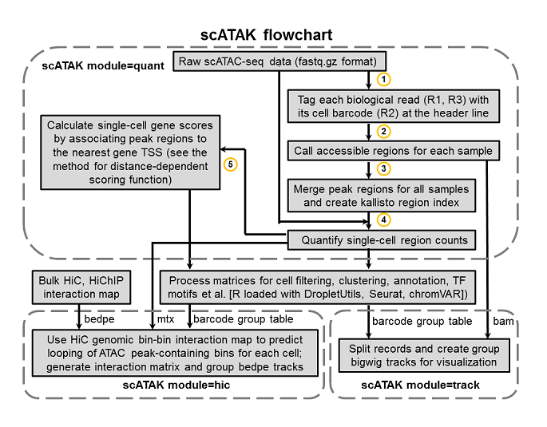

[](https://github.com/pachterlab/scATAK/releases)


### scATAK: pre-processing of 10X Genomics single-cell ATAC-seq data.
#####
##### The scATAK workflow is shown below:

#####
### Installation
1) Download the latest scATAK from https://github.com/pachterlab/scATAK/releases
```
tar -xvzf scATAK_v1.1.0.tar.gz
chmod +x scATAK/scATAK
```

2) Add `export SCATAK_HOME=/PATH_TO_scATAK/` to `.bashrc` file, and then `source .bashrc`.  

### USAGE
```
$SCATAK_HOME/scATAK -h

######################################################################################

scATAK [options]
-module=quant [please choose 'quant' for single-cell quantification, 'track' for group bigwig track generation, 'hic' for HiC related analysis]
Please specify the following options:
-id --sample_id=sample_sheet.csv [a sample information sheet for fastq files, must be csv format]
-genome --genome_fasta=Mus_musculus.GRCm38.dna_rm.primary_assembly.fa [ENSEMBL genome fasta file for the organism of your interest]
-gene --gene_gtf=Mus_musculus.GRCm38.101.chr.gtf [ENSEMBL gene gtf file for the organism of your interest]
-bc --blen=16 [length of cell barcode, default:16]
-bf --flen=40 [length of biological feature, should not be longer than R2 read length, default:40]
-bg --bc_group=bc_group.txt [a two-column text file with Barcode and Group. First line should be 'Barcode' and 'Group'] (for -module=track or -module=hic
-bam --bam_file=peak_calling/sampleX.bam [scATAK quant mapped bam file for sampleX] (for -module=track only)
-hic --hic_bedpe=sample_significant.bedpe [hic interaction bedpe file] (for -module=hic only)
-bin --hic_binsize=10000 [hic interaction bin size, default 10kb] (for -module=hic only)
-mtxdir --region_mtxdir=atac_regions/atac_sampleX [atac region matrix directory for sampleX] (for -module=hic only)
-t --thread=8 [threads to use, default:8]
-h --help [Help information]
```

### INPUT FILE FORMAT
##### sample_sheet.csv
| sample ID | Sample Group | R1 Biological Read FASTQ | R2 Cell Barcode Read FASTQ | R3 Biological Read FASTQ | Barcode Whitelist |
|-------------|------------------|-------------|---------------|-------------------------|-----------------|
#####
##### See a demo sample_sheet.csv below:
```
male1,male,B8_S1_L001_R1_001.fastq.gz,B8_S1_L001_R2_001.fastq.gz,B8_S1_L001_R3_001.fastq.gz,/home/fgao/scATAK/lib/737K-cratac-v1.txt
male2,male,B9_S1_L003_R1_001.fastq.gz,B9_S1_L003_R2_001.fastq.gz,B9_S1_L003_R3_001.fastq.gz,/home/fgao/scATAK/lib/737K-cratac-v1.txt
male3,male,B10_S1_L004_R1_001.fastq.gz,B10_S1_L004_R2_001.fastq.gz,B10_S1_L004_R3_001.fastq.gz,/home/fgao/scATAK/lib/737K-cratac-v1.txt
female1,female,4_F_S1_L004_R1_001.fastq.gz,4_F_S1_L004_R2_001.fastq.gz,4_F_S1_L004_R3_001.fastq.gz,/home/fgao/scATAK/lib/737K-cratac-v1.txt
female2,female,5_F_S1_L001_R1_001.fastq.gz,5_F_S1_L001_R2_001.fastq.gz,5_F_S1_L001_R3_001.fastq.gz,/home/fgao/scATAK/lib/737K-cratac-v1.txt
female3,female,6_F_S1_L002_R1_001.fastq.gz,6_F_S1_L002_R2_001.fastq.gz,6_F_S1_L002_R3_001.fastq.gz,/home/fgao/scATAK/lib/737K-cratac-v1.txt
```
#####
#####
##### bc_group.txt
| Cell Barcodes | Cell Type Group |
|-------------|------------------|
#####
##### See a demo bc_group.txt below:
```
Barcodes Groups
AAACGAAAGCCTCGCA Oligodendrocytes
AAACGAAAGGAAGAAC Oligodendrocytes
AAACGAACAGCAACGA OPC
AAACGAACATTACTCT Microglia
AAACGAATCACTCGGG Oligodendrocytes
AAACGAATCCTTACGC Oligodendrocytes
AAACGAATCGATCTTT Astrocytes
```
#####
#####
### Quick start:
```
#Quant module
$SCATAK_HOME/scATAK -module=quant -id=sample_sheet.csv -wlist=737K-cratac-v1.txt -genome=Homo_sapiens.GRCh38.dna_rm.primary_assembly.fa -gene=Homo_sapiens.GRCh38.101.chr.gtf -bc=16 -bf=40 -t=4

#Track module
$SCATAK_HOME/scATAK -module=track -bg=bc_group.txt -bam=peak_calling/sampleX.bam -genome=Homo_sapiens.GRCh38.dna_rm.primary_assembly.fa

#Hic module
$SCATAK_HOME/scATAK -module=hic -bg=bc_group.txt -hic=sample_significant.bedpe -bin=10000 -mtxdir=atac_regions/atac_sampleX -t=16
```

### Citation:
```
Please cite the following paper when you use scATAK:
Gao, F. & Pachter, L. (2021). Efficient pre-processing of single-cell ATAC-seq data. BioRxiv
```

### Benchmarks (based on v1.0.0)
```
https://github.com/pachterlab/GP_2021_4
```
